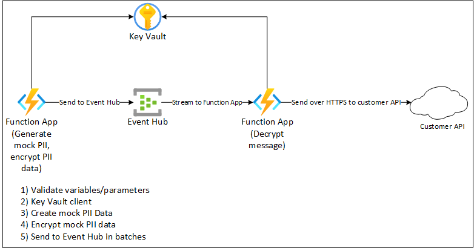
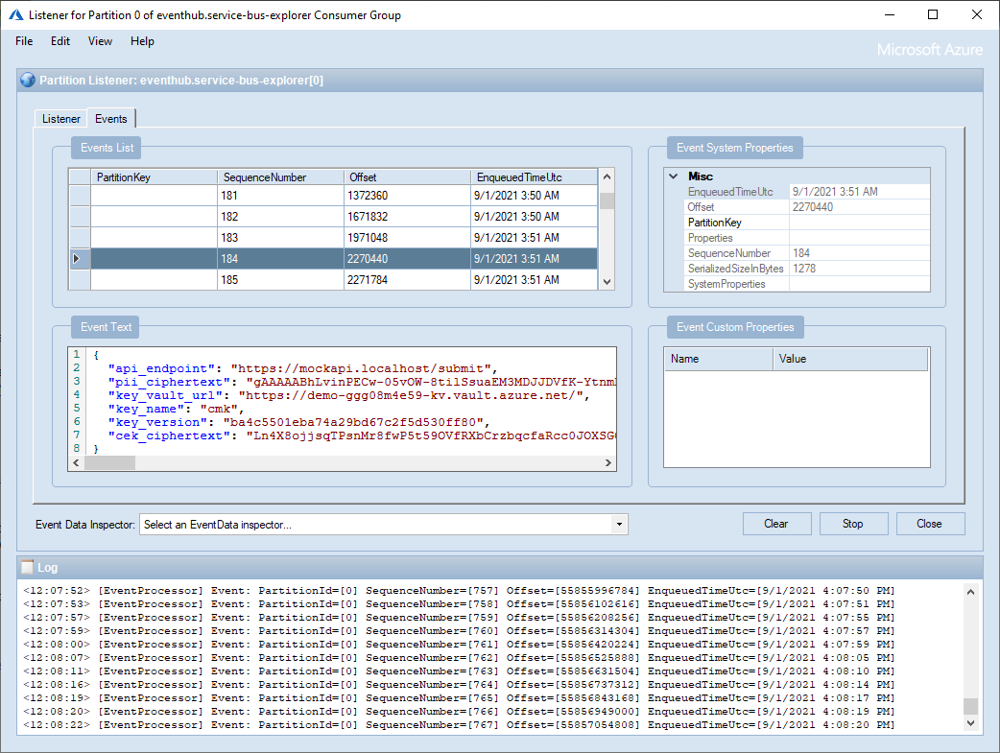

# Azure Functions Encryption Demo (to prove scalability)

## Overview

This is a demo that shows Azure Functions encrypting and decrypting mock PII data as a proof of concept **to prove out scalability**. This demo is not necessarily intended to show security and encryption capabilities of Key Vault or any other third-party libraries used as part of this code. As such, any capabilities in this demo (including encryption routines used) are purely meant as examples and are not meant to be used as production code.

The goal of this demo is to show how Azure Functions and Event Hub scalability can handle and mitigate potential performance impact of encryption/decryption of messages at a rate of 100s+ transactions per second. The slowest part of the Azure Function shown in this demo is generating the mock PII data, compared to the decryption that can be performed in a matter of 20-60 millseconds (ms) and handle hundreds of events per second. High performance is handled by the scale of Azure infrastructure as well as taking advantage of opportunities like in-memory code caching.

## What is included in this demo?
* Terraform infrastructure as code (IaC) for the Azure resources
* Python code for the two sample functions (Encrypt and Decrypt)


## How does it look at a high level?
Architecture overview:


## How does it work at a high level?

Azure Function (for encryption)
1. Invoked from HTTP request. Function is not anonymous and can only be accessed using function keys, it also requires query string parameter **event_count** and optional parameter **batch_count**
2. Validates required environment variables, input, and parameters. Uses Key Vault, Event Hub, and other details from environment variables
3. Initializes Key Vault client, caches in-memory as a global/public variable
4. Generates mock PII data using the [Python Faker module](https://pypi.org/project/Faker/)
5. Generates a symmetric key using the [Python Cryptography module](https://pypi.org/project/cryptography/), aka a symmetric content encryption key (CEK). CEK is protected using asymmetric encryption using Key Vault
6. Send event to Event Hub

Azure Function (for decryption)
1. Use Key Vault and CEK to decrypt message
2. Cache the Key Vault client and CEK in-memory to perform additional executions
3. Send decrypted mock PII data to downstream API

## How to deploy the infrastructure?
````
terraform init
terraform apply
````

## How to deploy the code?
* Use Visual Studio Code or command line tools to deploy code to Azure Functions


## Debugging
* Both Functions share the same Application Insights, useful for transaction searching
* Leverage Visual Studio Code to run functions locally and debug in real time
* Use a third-party tool like [Service Bus Explorer](https://github.com/paolosalvatori/ServiceBusExplorer) to 'peek' into the Event Hub data, for example:



## Future to do actions:
Items that are on the bucket list and for now are outside the scope of this demo
1. Implement Private Endpoints on PaaS services
2. Leverage Managed Identity for sending/receiving from Event Hub
